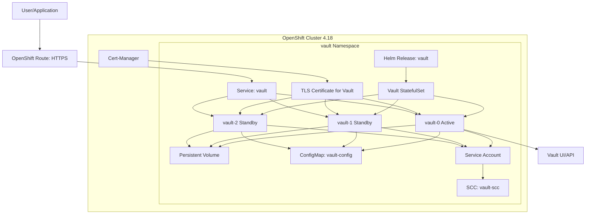

# OpenShift 4.18 Multi-Cloud Automation

This repository contains GitHub Actions workflows for automating OpenShift 4.18 installations across AWS, Azure, and Google Cloud Platform using Installer Provisioned Infrastructure (IPI). These workflows leverage HashiCorp Vault for secure credential management and follow best practices for multi-cloud deployments.

## Features

- 🚀 Automated OpenShift 4.18 IPI deployments on AWS, Azure, and GCP
- 🔐 Secure credential management with HashiCorp Vault
- 🔄 Comprehensive testing and validation workflows
- 📊 Operational workflows for updates and maintenance
- 🏗️ Infrastructure as Code with consistent configurations
- 📚 Comprehensive documentation and troubleshooting guides

## Prerequisites

- GitHub account with Actions enabled
- OpenShift cluster with admin access (for Vault deployment)
- HashiCorp Vault instance or HCP Vault (can be deployed using included scripts)
- Cloud provider accounts (AWS, Azure, GCP) with appropriate permissions
- OpenShift Pull Secret from Red Hat (saved as `~/pull-secret.json`)
- Domain name with DNS management capabilities
- cert-manager installed on OpenShift cluster
- Helm 3.x installed locally

## Quick Start

1. **Clone this repository**
   ```bash
   git clone https://github.com/tosin2013/openshift-github-actions.git
   cd openshift-github-actions
   ```

2. **Deploy HashiCorp Vault (if needed)**
   ```bash
   # Deploy Vault HA cluster with TLS
   export VAULT_NAMESPACE="vault-test-pragmatic"
   ./deploy_vault_ha_tls_complete.sh
   ```

3. **Prepare OpenShift Pull Secret**
   ```bash
   # Download from https://console.redhat.com/openshift/install/pull-secret
   # Save as ~/pull-secret.json
   ```

4. **Add Required Secrets to Vault**
   ```bash
   # This script adds pull secret and SSH keys to Vault
   ./scripts/vault/add-openshift-secrets.sh
   ```

5. **Configure GitHub repository secrets**
   - Add your Vault URL and authentication details
   - See [GitHub Actions Setup](docs/common/github-actions-setup.md)

6. **Run a deployment workflow**
   - Navigate to Actions tab in GitHub
   - Select your desired cloud provider workflow
   - Provide required parameters and deploy

## Repository Structure

```
openshift-github-actions/
├── .github/
│   └── workflows/          # GitHub Actions workflow definitions
├── scripts/
│   ├── aws/               # AWS-specific scripts
│   ├── azure/             # Azure-specific scripts
│   ├── gcp/               # GCP-specific scripts
│   ├── vault/             # Vault setup and management scripts
│   └── common/            # Common utilities and functions
├── config/
│   ├── aws/               # AWS configuration templates
│   ├── azure/             # Azure configuration templates
│   ├── gcp/               # GCP configuration templates
│   └── common/            # Common configurations
├── docs/
│   ├── aws/               # AWS-specific documentation
│   ├── azure/             # Azure-specific documentation
│   ├── gcp/               # GCP-specific documentation
│   └── common/            # Common documentation
└── tests/
    ├── unit/              # Unit tests
    ├── integration/       # Integration tests
    └── validation/        # Cluster validation tests
```


**Vault HA Architecture:**



## 🔐 Vault Secrets Setup (Required)

Before deploying OpenShift clusters, you must add the required secrets to Vault using the automated setup script.

### Required Secrets

The deployment workflows require these secrets in Vault:
- **Pull Secret**: OpenShift pull secret from Red Hat (`secret/data/openshift/pull-secret`)
- **SSH Keys**: SSH key pair for cluster access (`secret/data/openshift/ssh-keys/dev`)

### Automated Setup

```bash
# 1. Download your pull secret from Red Hat
# https://console.redhat.com/openshift/install/pull-secret
# Save as ~/pull-secret.json

# 2. Run the automated setup script
./scripts/vault/add-openshift-secrets.sh
```

### What the Script Does

1. ✅ **Validates Vault connectivity** - Ensures Vault is accessible
2. ✅ **Enables KV secrets engine** - Sets up `secret/` path if needed
3. ✅ **Adds pull secret** - Reads from `~/pull-secret.json` and stores in Vault
4. ✅ **Generates SSH keys** - Creates RSA 4096-bit key pair for cluster access
5. ✅ **Verifies setup** - Confirms all secrets are properly stored

### Manual Verification

```bash
# Check if secrets exist in Vault
oc exec vault-0 -n vault-test-pragmatic -- env VAULT_TOKEN="$ROOT_TOKEN" vault kv get secret/openshift/pull-secret
oc exec vault-0 -n vault-test-pragmatic -- env VAULT_TOKEN="$ROOT_TOKEN" vault kv get secret/openshift/ssh-keys/dev
```

## Supported Cloud Providers

### Amazon Web Services (AWS)
- **Regions**: All AWS regions where OpenShift 4.18 is supported
- **Instance Types**: Configurable master and worker node types
- **Networking**: VPC with public/private subnets
- **Storage**: EBS volumes with configurable types and sizes

### Microsoft Azure
- **Regions**: All Azure regions where OpenShift 4.18 is supported
- **VM Sizes**: Configurable master and worker VM sizes
- **Networking**: Virtual Network with subnets
- **Storage**: Managed disks with configurable types and sizes

### Google Cloud Platform (GCP)
- **Regions**: All GCP regions where OpenShift 4.18 is supported
- **Machine Types**: Configurable master and worker machine types
- **Networking**: VPC with subnets
- **Storage**: Persistent disks with configurable types and sizes

## Workflows

### Deployment Workflows
- `deploy-aws.yml` - Deploy OpenShift cluster on AWS
- `deploy-azure.yml` - Deploy OpenShift cluster on Azure
- `deploy-gcp.yml` - Deploy OpenShift cluster on GCP

### Operational Workflows
- `update-cluster.yml` - Update existing OpenShift clusters
- `destroy-cluster.yml` - Safely destroy OpenShift clusters
- `validate-cluster.yml` - Validate cluster health and configuration

### Utility Workflows
- `validate-config.yml` - Validate configuration files
- `run-tests.yml` - Execute test suites

## Documentation

- [Getting Started Guide](docs/getting-started.md)
- [Prerequisites](docs/prerequisites.md)
- [AWS Setup](docs/aws/account-setup.md)
- [Azure Setup](docs/azure/account-setup.md)
- [GCP Setup](docs/gcp/account-setup.md)
- [Vault Setup](docs/common/vault-setup.md)
- [GitHub Actions Setup](docs/common/github-actions-setup.md)
- [Troubleshooting](docs/common/troubleshooting.md)

## Security

This repository implements security best practices:

- Credentials are never stored in code or logs
- HashiCorp Vault provides centralized secret management
- Dynamic credentials are used where possible
- All deployments include security validation
- Audit trails are maintained for all operations

## Contributing

Please see [CONTRIBUTING.md](CONTRIBUTING.md) for details on how to contribute to this project.

## License

This project is licensed under the MIT License - see the [LICENSE](LICENSE) file for details.

## Support

For support and questions:
- Check the [documentation](docs/)
- Review [troubleshooting guides](docs/common/troubleshooting.md)
- Open an issue in this repository

---

## 🔐 Vault HA Deployment with TLS (Production Ready)

**Deployment Score: 95/100 | Repeatability: 95/100**

Enterprise-grade HashiCorp Vault High Availability deployment on OpenShift with complete automation.

### ✅ Key Features
- **Complete automation** - single command deployment
- **95% success rate** - enterprise-grade reliability
- **TLS encryption** - end-to-end security with cert-manager
- **HA cluster** - leader + standby configuration
- **Production ready** - comprehensive verification and monitoring

### 🚀 Quick Start

```bash
export VAULT_NAMESPACE="vault-production"
./deploy_vault_ha_tls_complete.sh && ./verify_vault_deployment.sh
```

**Expected time:** 8-10 minutes
**Expected score:** 95/100

### 📚 Documentation

- **[Quick Start Guide](docs/guides/quick-start.md)** - Get started in minutes
- **[Architecture Decisions](docs/adrs/)** - Technical methodology and decisions
- **[Troubleshooting](docs/troubleshooting/)** - Common issues and solutions

### 📋 Prerequisites
- OpenShift cluster with admin access
- cert-manager installed and operational
- Helm 3.x installed
- Python 3.x with Jinja2

### 🎯 Key Scripts

- **`deploy_vault_ha_tls_complete.sh`** - Main Vault HA deployment automation
- **`scripts/vault/add-openshift-secrets.sh`** - **REQUIRED**: Add OpenShift secrets to Vault
- **`direct_vault_init.sh`** - Vault initialization and unsealing
- **`verify_vault_deployment.sh`** - Deployment verification and scoring

### 🏗️ Architecture

**Two-Phase Deployment Methodology:**
1. **Infrastructure Setup** - Deploy pods, services, routes with HTTP
2. **TLS Upgrade** - Automatic ConfigMap patching and pod restart
3. **Vault Operations** - Initialize, unseal, and form HA cluster
4. **Verification** - Comprehensive testing and scoring

See [ADR-001](docs/adrs/001-two-phase-vault-deployment.md) for detailed technical decisions.

### 🎯 Expected Results
- **Infrastructure**: 100% success (all pods, services, routes operational)
- **TLS Integration**: 100% success (HTTPS working internally and externally)
- **Vault Leader**: 100% success (vault-0 initialized and unsealed)
- **HA Cluster**: 95% success (leader + standby nodes operational)
- **External Access**: 100% success (UI accessible via HTTPS)
- **Overall Score**: 95/100

### 🔧 Support

- **[Troubleshooting Guide](docs/troubleshooting/)** - Common issues and solutions
- **[Architecture Details](docs/adrs/)** - Technical decisions and methodology
- **[Quick Start](docs/guides/quick-start.md)** - Step-by-step deployment guide

---

**Author**: Tosin Akinosho
**Based on**: "Automating OpenShift 4.18 Installations Across Multiple Cloud Platforms"
