# ADR-004: GitHub Actions Workflow Orchestration Strategy

**Status:** Proposed  
**Date:** 2025-06-04  
**Authors:** Tosin Akinosho, Sophia AI Assistant  
**Reviewers:** Development Team  

## Context

With our proven Vault HA deployment (95% success rate) and the multi-cloud Vault integration strategy (ADR-003), we need to design GitHub Actions workflows that orchestrate complete multi-cloud OpenShift deployments with deep Vault integration.

### Current State
- ✅ **Vault HA Scripts**: Proven deployment automation (95% success)
- ✅ **Multi-Cloud Strategy**: Centralized Vault hub model defined
- ⚠️ **GitHub Actions Gap**: No CI/CD workflows implemented
- ⚠️ **Orchestration Gap**: No workflow dependency management
- ⚠️ **Multi-Cloud Gap**: No cloud-specific deployment workflows

### Requirements
1. **Vault-First Deployment**: Vault must be deployed before any OpenShift clusters
2. **Multi-Cloud Support**: Parallel or sequential deployments across AWS, Azure, GCP
3. **Dynamic Credentials**: Secure credential retrieval from Vault
4. **Error Handling**: Robust rollback and recovery mechanisms
5. **Reusability**: Modular workflows for different deployment scenarios
6. **Monitoring**: Comprehensive logging and status reporting

## Decision

Implement a **Hierarchical Workflow Architecture** with Vault as the foundational dependency:

### Workflow Architecture

```mermaid
graph TD
    A[🚀 Multi-Cloud Deployment Trigger] --> B{Vault HA Available?}
    
    B -->|❌ No| C[Deploy Vault HA]
    C --> D[Configure Secrets Engines]
    D --> E[Setup Authentication]
    E --> F[Verify Vault Ready]
    
    B -->|✅ Yes| F
    F --> G[Parallel Cloud Deployments]
    
    G --> H[AWS OpenShift Deploy]
    G --> I[Azure OpenShift Deploy] 
    G --> J[GCP OpenShift Deploy]
    
    H --> K[AWS Post-Config]
    I --> L[Azure Post-Config]
    J --> M[GCP Post-Config]
    
    K --> N[Multi-Cloud Verification]
    L --> N
    M --> N
    
    N --> O[🎉 Deployment Complete]
    
    style C fill:#e1f5fe
    style O fill:#c8e6c9
```



### Core Workflow Design Principles

#### 1. **Dependency-First Architecture**
- **Foundation**: Vault HA deployment is prerequisite for all cloud deployments
- **Validation**: Each workflow validates dependencies before proceeding
- **Fail-Fast**: Early validation prevents partial deployments

#### 2. **Modular Workflow Design**
```yaml
# Main orchestration workflow
name: Deploy Multi-Cloud OpenShift
on:
  workflow_dispatch:
    inputs:
      clouds:
        description: 'Clouds to deploy (aws,azure,gcp)'
        required: true
        default: 'aws'
      environment:
        description: 'Environment (dev,staging,prod)'
        required: true
        default: 'dev'

jobs:
  vault-foundation:
    uses: ./.github/workflows/deploy-vault-ha.yml
    
  aws-deployment:
    if: contains(inputs.clouds, 'aws')
    needs: vault-foundation
    uses: ./.github/workflows/deploy-openshift-aws.yml
    
  azure-deployment:
    if: contains(inputs.clouds, 'azure')
    needs: vault-foundation
    uses: ./.github/workflows/deploy-openshift-azure.yml
    
  gcp-deployment:
    if: contains(inputs.clouds, 'gcp')
    needs: vault-foundation
    uses: ./.github/workflows/deploy-openshift-gcp.yml
```

#### 3. **Vault Integration Pattern**
```yaml
# Standard Vault authentication step
- name: Authenticate to Vault
  uses: hashicorp/vault-action@v2
  with:
    url: ${{ secrets.VAULT_URL }}
    method: jwt
    role: github-actions-${{ inputs.environment }}
    secrets: |
      aws/creds/openshift-installer access_key | AWS_ACCESS_KEY_ID ;
      aws/creds/openshift-installer secret_key | AWS_SECRET_ACCESS_KEY ;
      openshift/data/pull-secret value | OPENSHIFT_PULL_SECRET
```

## Consequences

### Positive
- **Leverages Proven Automation**: 95% success rate Vault deployment
- **Secure by Design**: No long-lived credentials in workflows
- **Scalable Architecture**: Easy to add new clouds or environments
- **Parallel Execution**: Multiple clouds can deploy simultaneously
- **Comprehensive Logging**: Full audit trail of all operations
- **Reusable Components**: Modular workflows reduce duplication
- **Fail-Safe Design**: Robust error handling and rollback

### Negative
- **Complexity**: Multi-level workflow dependencies
- **Vault Dependency**: All deployments depend on Vault availability
- **Longer Initial Setup**: Vault deployment adds time to first run
- **GitHub Actions Limits**: Workflow concurrency and timeout constraints

### Neutral
- **Learning Curve**: Team needs GitHub Actions workflow expertise
- **Monitoring Requirements**: Need comprehensive workflow monitoring
- **Cost Considerations**: GitHub Actions usage costs for large deployments

## Implementation

### Phase 1: Foundation Workflows
1. **Vault HA Deployment Workflow**
   ```yaml
   # .github/workflows/deploy-vault-ha.yml
   name: Deploy Vault HA
   on:
     workflow_call:
       inputs:
         namespace:
           required: false
           default: 'vault-production'
           type: string
   
   jobs:
     deploy-vault:
       runs-on: ubuntu-latest
       steps:
         - uses: actions/checkout@v4
         - name: Deploy Vault HA
           run: |
             export VAULT_NAMESPACE="${{ inputs.namespace }}"
             ./deploy_vault_ha_tls_complete.sh
         - name: Verify Deployment
           run: ./verify_vault_deployment.sh
   ```

2. **Secrets Engine Configuration Workflow**
   ```yaml
   # Configure all cloud provider secrets engines
   - name: Configure AWS Secrets Engine
     run: |
       vault secrets enable -path=aws aws
       vault write aws/config/root access_key=${{ secrets.AWS_ROOT_ACCESS_KEY }}
   ```

### Phase 2: Cloud-Specific Workflows
1. **AWS OpenShift Deployment**
2. **Azure OpenShift Deployment**  
3. **GCP OpenShift Deployment**

### Phase 3: Orchestration Workflows
1. **Multi-Cloud Deployment Orchestrator**
2. **Environment-Specific Workflows (dev/staging/prod)**
3. **Disaster Recovery Workflows**

### Success Metrics
- **Deployment Success Rate**: Target 95% (matching Vault HA success)
- **Deployment Time**: < 60 minutes for single cloud, < 90 minutes for multi-cloud
- **Security**: Zero exposed credentials in logs or artifacts
- **Reliability**: Successful rollback in case of failures

## Alternatives Considered

### Monolithic Workflow
- **Rejected**: Single large workflow is hard to maintain and debug
- **Issues**: No reusability, difficult error handling, long execution times

### External Orchestration (Terraform Cloud, etc.)
- **Rejected**: Adds external dependencies and complexity
- **Issues**: Additional cost, vendor lock-in, integration complexity

### Manual Orchestration
- **Rejected**: Reduces automation benefits and increases human error
- **Issues**: Not scalable, inconsistent execution, no audit trail

### Cloud-Native CI/CD (AWS CodePipeline, etc.)
- **Rejected**: Vendor lock-in, doesn't support multi-cloud scenarios
- **Issues**: Different tools per cloud, no unified approach

## References

- [GitHub Actions Workflow Syntax](https://docs.github.com/en/actions/using-workflows/workflow-syntax-for-github-actions)
- [Reusable Workflows](https://docs.github.com/en/actions/using-workflows/reusing-workflows)
- [HashiCorp Vault Action](https://github.com/hashicorp/vault-action)
- [OpenShift GitHub Actions](https://github.com/redhat-actions)
- **Related ADRs**: ADR-001 (Vault HA), ADR-003 (Multi-Cloud Integration), ADR-005 (Dynamic Secrets)
