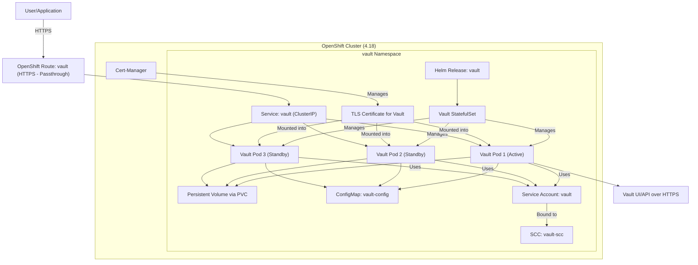

# ADR-005: Dynamic Secrets and Credential Management Strategy

**Status:** Proposed  
**Date:** 2025-06-04  
**Authors:** Tosin Akinosho, Sophia AI Assistant  
**Reviewers:** Development Team  

## Context

With our Vault HA cluster (95% success rate) serving as the central hub for multi-cloud OpenShift automation, we need to establish a comprehensive strategy for dynamic secrets and credential management that ensures security, compliance, and operational efficiency.

### Current State
- ✅ **Vault HA Infrastructure**: Production-ready with 95% success rate
- ✅ **Multi-Cloud Strategy**: Central hub model defined (ADR-003)
- ✅ **Workflow Architecture**: GitHub Actions orchestration planned (ADR-004)
- ⚠️ **Security Gap**: No dynamic credential strategy defined
- ⚠️ **Compliance Gap**: No credential lifecycle management
- ⚠️ **Operational Gap**: No credential rotation or emergency procedures

### Requirements
1. **Zero Long-Lived Credentials**: No static credentials in workflows or configurations
2. **Just-In-Time Access**: Credentials generated only when needed
3. **Least Privilege**: Minimal permissions for specific operations
4. **Audit Trail**: Complete logging of credential access and usage
5. **Automatic Rotation**: Regular credential refresh without manual intervention
6. **Emergency Access**: Break-glass procedures for critical situations
7. **Compliance**: Meet enterprise security and regulatory requirements

## Decision

Implement a **Zero-Trust Dynamic Credential Architecture** with time-bound, purpose-specific credentials:

### Credential Lifecycle Architecture



### Core Security Principles

#### 1. **Time-Bound Credentials**
```yaml
# AWS Secrets Engine Configuration
vault write aws/roles/openshift-installer \
  credential_type=iam_user \
  default_sts_ttl=1800 \
  max_sts_ttl=3600 \
  policy_document=@minimal-openshift-policy.json
```

#### 2. **Purpose-Specific Roles**
```hcl
# Separate roles for different operations
aws/roles/openshift-installer    # Cluster creation only
aws/roles/openshift-operator     # Day-2 operations
aws/roles/openshift-destroyer    # Cluster deletion only
aws/roles/openshift-monitor      # Read-only monitoring
```

#### 3. **Environment Isolation**
```hcl
# Environment-specific paths
aws/roles/dev-openshift-installer
aws/roles/staging-openshift-installer  
aws/roles/prod-openshift-installer
```

## Consequences

### Positive
- **Enhanced Security**: No long-lived credentials reduce attack surface
- **Compliance Ready**: Automatic audit trails and credential rotation
- **Operational Safety**: Credentials auto-expire, reducing blast radius
- **Scalable**: Easy to add new clouds, environments, or use cases
- **Traceable**: Complete audit trail of who accessed what when
- **Automated**: No manual credential management required
- **Flexible**: Different TTLs for different operations

### Negative
- **Complexity**: More sophisticated credential management
- **Vault Dependency**: All operations depend on Vault availability
- **Network Requirements**: Reliable connectivity to Vault required
- **Learning Curve**: Team needs to understand dynamic credential concepts

### Neutral
- **Performance Impact**: Slight overhead for credential generation
- **Monitoring Requirements**: Need to monitor credential usage patterns
- **Cost Considerations**: More API calls to cloud providers

## Implementation

### Phase 1: AWS Dynamic Credentials

#### 1. **AWS Secrets Engine Setup**
```bash
# Enable AWS secrets engine
vault secrets enable -path=aws aws

# Configure root credentials (stored securely in Vault)
vault write aws/config/root \
  access_key=$AWS_ROOT_ACCESS_KEY \
  secret_key=$AWS_ROOT_SECRET_KEY \
  region=us-east-1

# Create role for OpenShift installation
vault write aws/roles/openshift-installer \
  credential_type=iam_user \
  default_sts_ttl=1800 \
  max_sts_ttl=3600 \
  policy_document=-<<EOF
{
  "Version": "2012-10-17",
  "Statement": [
    {
      "Effect": "Allow",
      "Action": [
        "ec2:*",
        "iam:CreateUser",
        "iam:CreateRole",
        "iam:AttachRolePolicy",
        "route53:*",
        "s3:*",
        "elasticloadbalancing:*"
      ],
      "Resource": "*"
    }
  ]
}
EOF
```

#### 2. **GitHub Actions Integration**
```yaml
- name: Get AWS Credentials from Vault
  uses: hashicorp/vault-action@v2
  with:
    url: ${{ secrets.VAULT_URL }}
    method: jwt
    role: github-actions-${{ inputs.environment }}
    secrets: |
      aws/creds/openshift-installer access_key | AWS_ACCESS_KEY_ID ;
      aws/creds/openshift-installer secret_key | AWS_SECRET_ACCESS_KEY

- name: Deploy OpenShift
  env:
    AWS_ACCESS_KEY_ID: ${{ env.AWS_ACCESS_KEY_ID }}
    AWS_SECRET_ACCESS_KEY: ${{ env.AWS_SECRET_ACCESS_KEY }}
  run: |
    openshift-install create cluster --dir=cluster-config
```

### Phase 2: Azure Dynamic Credentials

#### 1. **Azure Secrets Engine Setup**
```bash
vault secrets enable -path=azure azure

vault write azure/config \
  subscription_id=$AZURE_SUBSCRIPTION_ID \
  tenant_id=$AZURE_TENANT_ID \
  client_id=$AZURE_CLIENT_ID \
  client_secret=$AZURE_CLIENT_SECRET

vault write azure/roles/openshift-installer \
  azure_roles=-<<EOF
[
  {
    "role_name": "Contributor",
    "scope": "/subscriptions/$AZURE_SUBSCRIPTION_ID"
  }
]
EOF \
  ttl=30m \
  max_ttl=1h
```

### Phase 3: GCP Dynamic Credentials

#### 1. **GCP Secrets Engine Setup**
```bash
vault secrets enable -path=gcp gcp

vault write gcp/config \
  credentials=@service-account-key.json

vault write gcp/roleset/openshift-installer \
  project=$GCP_PROJECT_ID \
  secret_type=service_account_key \
  token_scopes="https://www.googleapis.com/auth/cloud-platform" \
  bindings=-<<EOF
resource "//cloudresourcemanager.googleapis.com/projects/$GCP_PROJECT_ID" {
  roles = [
    "roles/compute.admin",
    "roles/dns.admin",
    "roles/iam.serviceAccountAdmin",
    "roles/storage.admin"
  ]
}
EOF
```

### Phase 4: OpenShift Secrets Management

#### 1. **KV Secrets Engine for OpenShift**
```bash
vault secrets enable -path=openshift kv-v2

# Store cluster credentials after deployment
vault kv put openshift/clusters/aws-dev-001 \
  kubeconfig=@kubeconfig \
  admin_password="$ADMIN_PASSWORD" \
  console_url="$CONSOLE_URL"
```

### Success Metrics
- **Security**: Zero long-lived credentials in any system
- **Compliance**: 100% audit trail coverage
- **Performance**: Credential generation < 10 seconds
- **Reliability**: 99.9% credential availability
- **Automation**: Zero manual credential operations

## Alternatives Considered

### Static Credentials in GitHub Secrets
- **Rejected**: Security risk, no rotation, compliance issues
- **Issues**: Long-lived credentials, manual rotation, audit gaps

### Cloud-Native Secret Managers Only
- **Rejected**: Inconsistent APIs, vendor lock-in
- **Issues**: Different tools per cloud, no unified audit

### External Secret Management Service
- **Rejected**: Additional cost and complexity
- **Issues**: Another system to manage, integration overhead

### Manual Credential Management
- **Rejected**: Not scalable, error-prone
- **Issues**: Human error, inconsistent processes, no automation

## References

- [Vault AWS Secrets Engine](https://developer.hashicorp.com/vault/docs/secrets/aws)
- [Vault Azure Secrets Engine](https://developer.hashicorp.com/vault/docs/secrets/azure)
- [Vault GCP Secrets Engine](https://developer.hashicorp.com/vault/docs/secrets/gcp)
- [GitHub OIDC with Vault](https://docs.github.com/en/actions/deployment/security-hardening-your-deployments/about-security-hardening-with-openid-connect)
- [OpenShift Installation Security](https://docs.openshift.com/container-platform/latest/installing/installing-preparing.html)
- **Related ADRs**: ADR-003 (Multi-Cloud Integration), ADR-004 (GitHub Actions), ADR-006 (AWS Integration)
