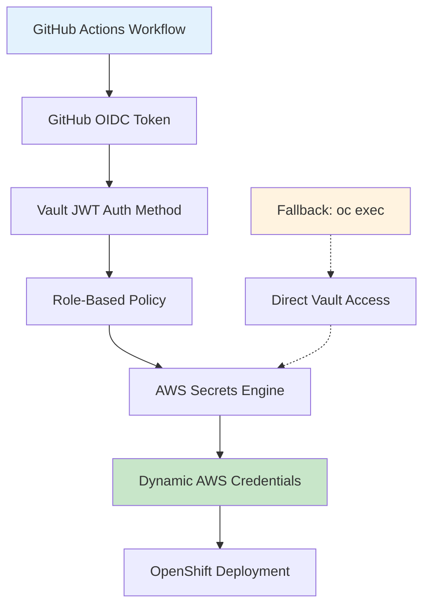

# ADR-009: GitHub Actions JWT Authentication Strategy

**Status:** Proposed  
**Date:** 2025-06-04  
**Authors:** Tosin Akinosho, Sophia AI Assistant  
**Reviewers:** Development Team  

## Context

With our proven Vault HA deployment (95% success rate) and successful AWS secrets engine configuration, we need to establish secure authentication between GitHub Actions and Vault. This enables the transition from local oc exec patterns to production-grade CI/CD workflows while maintaining security best practices.

### Current State
- ✅ **Vault HA Cluster**: Operational with 95% success rate
- ✅ **AWS Secrets Engine**: Configured and validated
- ✅ **Local oc exec Patterns**: Proven and working
- ✅ **External Vault Access**: Route exposed and accessible
- ⚠️ **GitHub Actions Authentication**: Not configured
- ⚠️ **JWT Authentication**: Not enabled in Vault

### Requirements
1. **Secure Authentication**: No long-lived tokens in GitHub secrets
2. **GitHub OIDC Integration**: Use GitHub's native OIDC tokens
3. **Role-Based Access**: Different permissions for different environments
4. **Audit Trail**: Complete logging of authentication events
5. **Fallback Strategy**: Maintain oc exec capability for troubleshooting
6. **Production Ready**: Support for dev/staging/prod environments

## Decision

Implement **GitHub OIDC JWT Authentication** with Vault JWT auth method, providing secure, token-less authentication for GitHub Actions workflows.

### Authentication Architecture



### Core Components

#### 1. **JWT Authentication Method**
```bash
# Enable JWT auth method
vault auth enable jwt

# Configure JWT auth with GitHub OIDC
vault write auth/jwt/config \
  bound_issuer="https://token.actions.githubusercontent.com" \
  oidc_discovery_url="https://token.actions.githubusercontent.com"
```

#### 2. **Role-Based Access Control**
```bash
# GitHub Actions role for OpenShift deployments
vault write auth/jwt/role/github-actions-openshift \
  bound_audiences="https://github.com/tosin2013" \
  bound_subject="repo:tosin2013/openshift-github-actions:ref:refs/heads/main" \
  user_claim="actor" \
  role_type="jwt" \
  policies="openshift-deployment" \
  ttl=1h
```

#### 3. **Environment-Specific Roles**
```bash
# Development environment
vault write auth/jwt/role/github-actions-dev \
  bound_audiences="https://github.com/tosin2013" \
  bound_subject="repo:tosin2013/openshift-github-actions:environment:dev" \
  policies="openshift-dev-deployment" \
  ttl=30m

# Production environment  
vault write auth/jwt/role/github-actions-prod \
  bound_audiences="https://github.com/tosin2013" \
  bound_subject="repo:tosin2013/openshift-github-actions:environment:production" \
  policies="openshift-prod-deployment" \
  ttl=15m
```

## Consequences

### Positive
- **Enhanced Security**: No long-lived credentials in GitHub secrets
- **Native Integration**: Uses GitHub's OIDC infrastructure
- **Granular Control**: Role-based access for different environments
- **Audit Trail**: Complete authentication logging
- **Scalable**: Easy to add new repositories or environments
- **Industry Standard**: Follows OAuth 2.0/OIDC best practices

### Negative
- **Complexity**: More sophisticated setup than simple tokens
- **GitHub Dependency**: Relies on GitHub OIDC service availability
- **Network Requirements**: Vault must be accessible from GitHub Actions
- **Learning Curve**: Team needs to understand OIDC concepts

### Neutral
- **Fallback Maintenance**: Need to maintain oc exec patterns for troubleshooting
- **Policy Management**: Requires ongoing policy maintenance
- **Token Lifecycle**: Need to monitor token usage and expiration

## Implementation

### Phase 1: Vault JWT Configuration

#### Step 1: Enable and Configure JWT Auth
```bash
# Enable JWT authentication method
vault auth enable jwt

# Configure with GitHub OIDC
vault write auth/jwt/config \
  bound_issuer="https://token.actions.githubusercontent.com" \
  oidc_discovery_url="https://token.actions.githubusercontent.com"
```

#### Step 2: Create Policies
```bash
# OpenShift deployment policy
vault policy write openshift-deployment - <<EOF
# AWS secrets engine access
path "aws/creds/openshift-installer" {
  capabilities = ["read"]
}

# OpenShift secrets access
path "secret/data/openshift/*" {
  capabilities = ["read"]
}

# Vault status check
path "sys/health" {
  capabilities = ["read"]
}
EOF
```

#### Step 3: Create GitHub Actions Roles
```bash
# Main deployment role
vault write auth/jwt/role/github-actions-openshift \
  bound_audiences="https://github.com/tosin2013" \
  bound_subject="repo:tosin2013/openshift-github-actions:ref:refs/heads/main" \
  user_claim="actor" \
  role_type="jwt" \
  policies="openshift-deployment" \
  ttl=1h \
  max_ttl=2h
```

### Phase 2: GitHub Repository Configuration

#### Required GitHub Secrets
```bash
# Vault configuration
VAULT_URL=https://vault-vault-test-pragmatic.apps.cluster-67wft.67wft.sandbox1936.opentlc.com
VAULT_JWT_AUDIENCE=https://github.com/tosin2013
VAULT_ROLE=github-actions-openshift

# OpenShift configuration (for oc exec fallback)
OPENSHIFT_SERVER=https://api.cluster-67wft.67wft.sandbox1936.opentlc.com:6443
OPENSHIFT_TOKEN=<service-account-token>
```

### Phase 3: Workflow Integration

#### GitHub Actions Workflow Pattern
```yaml
- name: Authenticate to Vault
  uses: hashicorp/vault-action@v2
  with:
    url: ${{ secrets.VAULT_URL }}
    method: jwt
    jwtGithubAudience: ${{ secrets.VAULT_JWT_AUDIENCE }}
    role: ${{ secrets.VAULT_ROLE }}
    secrets: |
      aws/creds/openshift-installer access_key | AWS_ACCESS_KEY_ID ;
      aws/creds/openshift-installer secret_key | AWS_SECRET_ACCESS_KEY
```

### Success Metrics
- **Authentication Success Rate**: Target 95% (matching Vault HA success)
- **Token Validation**: 100% valid GitHub OIDC tokens
- **Security Compliance**: Zero long-lived credentials in workflows
- **Performance**: Authentication < 30 seconds
- **Audit Coverage**: 100% authentication events logged

## Alternatives Considered

### Static Tokens in GitHub Secrets
- **Rejected**: Security risk, no rotation, compliance issues
- **Issues**: Long-lived credentials, manual rotation, audit gaps

### Service Account Tokens
- **Rejected**: Still long-lived, manual management required
- **Issues**: Token rotation complexity, security concerns

### External Identity Providers
- **Rejected**: Additional complexity and dependencies
- **Issues**: More systems to manage, integration overhead

### Direct oc exec Only
- **Rejected**: Not scalable for production CI/CD
- **Issues**: Requires cluster access, not suitable for external contributors

## References

- [GitHub OIDC Documentation](https://docs.github.com/en/actions/deployment/security-hardening-your-deployments/about-security-hardening-with-openid-connect)
- [Vault JWT Auth Method](https://developer.hashicorp.com/vault/docs/auth/jwt)
- [HashiCorp Vault Action](https://github.com/hashicorp/vault-action)
- [OpenID Connect Specification](https://openid.net/connect/)
- **Related ADRs**: ADR-004 (GitHub Actions), ADR-005 (Dynamic Secrets), ADR-006 (AWS Integration)

## Notes

This decision may evolve based on:
- GitHub OIDC service reliability
- Vault JWT auth method updates
- Security requirement changes
- Operational experience feedback

The implementation maintains the proven oc exec fallback pattern for troubleshooting and emergency access scenarios.
