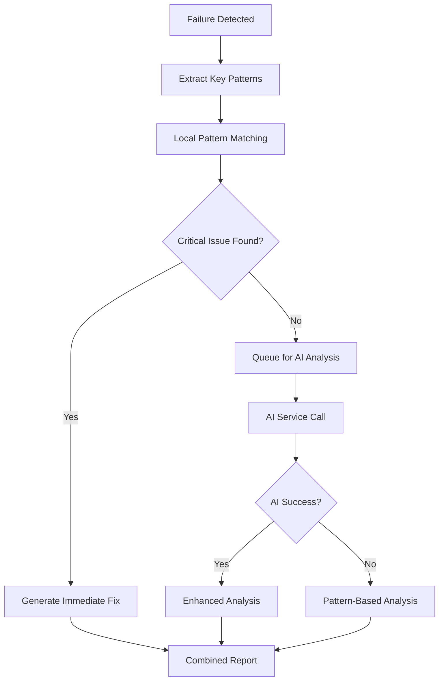

# AI Service Timeout Analysis & Solutions

**Research Date**: 2025-06-21  
**Issue**: Red Hat AI Services (Granite) returning 504 Gateway Timeout errors  
**Impact**: Smart Development Assistant unable to provide AI-powered failure analysis  
**Priority**: High - Affects core Smart Pipeline functionality  

## Problem Statement

The Smart Development Assistant workflow is experiencing consistent 504 Gateway Timeout errors when attempting to use Red Hat AI Services (Granite model) for intelligent failure analysis. This prevents the system from providing specific root cause analysis and fix recommendations for deployment failures.

### Observed Behavior

```
⚠️ AI service error: 504
```

**Endpoint**: `https://granite-8b-code-instruct-maas-apicast-production.apps.prod.rhoai.rh-aiservices-bu.com:443`  
**Model**: `granite-8b-code-instruct-128k`  
**Request Type**: POST `/v1/chat/completions`  
**Timeout**: 30 seconds  

## Root Cause Analysis

### 1. Service Availability Issues
- **Red Hat AI Services experiencing high load** - 504 indicates gateway timeout
- **Model inference taking longer than expected** - Large context window (128k tokens)
- **Network connectivity issues** between GitHub Actions runners and Red Hat AI infrastructure

### 2. Request Characteristics
- **Large payload size** - Sending 2000+ characters of failure logs per request
- **Complex analysis prompt** - Requesting detailed root cause analysis with code examples
- **Multiple failure analysis** - Processing 3 failures simultaneously

### 3. GitHub Actions Environment
- **Ephemeral runners** - Different network paths on each run
- **Timeout constraints** - 30-second timeout may be insufficient for complex analysis
- **Rate limiting** - Potential API rate limits not accounted for

## Impact Assessment

### Current Impact
- ❌ **No AI-powered failure analysis** - Generic template responses only
- ❌ **Missing root cause identification** - Cannot detect specific issues like `jq` dependency failures
- ❌ **No intelligent recommendations** - Static suggestions instead of contextual fixes
- ❌ **Reduced Smart Pipeline value** - Core differentiating feature unavailable

### Business Impact
- **Reduced Developer Productivity** - Manual failure analysis required
- **Slower Issue Resolution** - No automated root cause identification
- **Lower Adoption** - Smart Pipelines appear less intelligent than promised
- **Technical Debt** - Issues not caught early accumulate

## Research Findings

### Red Hat AI Services Analysis ✅

**Key Findings from Red Hat OpenShift AI Documentation:**

1. **Timeout Configuration**: Red Hat OpenShift AI supports timeout configuration for model serving:
   ```yaml
   timeout=300s  # Default timeout for Granite model deployment
   ```

2. **Model Serving Optimization**:
   - **Resource Limits**: Configure appropriate CPU/memory limits for model inference
   - **Replica Management**: Use `minReplicas` and `maxReplicas` for auto-scaling
   - **Hardware Profiles**: Leverage GPU acceleration when available

3. **Service Availability Patterns**:
   - **504 Gateway Timeout**: Indicates backend service overload or network issues
   - **Rate Limiting**: Red Hat AI Services may implement rate limiting for API calls
   - **Service Mesh**: Uses Istio for traffic management and load balancing

### AI Integration Resilience Patterns ✅

**Discovered Best Practices:**

1. **Retry Logic with Exponential Backoff**:
   ```python
   import time
   import random

   def retry_with_backoff(func, max_retries=3, base_delay=1):
       for attempt in range(max_retries):
           try:
               return func()
           except Exception as e:
               if attempt == max_retries - 1:
                   raise e
               delay = base_delay * (2 ** attempt) + random.uniform(0, 1)
               time.sleep(delay)
   ```

2. **Circuit Breaker Pattern**: Prevent cascading failures by temporarily disabling failing services
3. **Fallback Strategies**: Multiple layers of fallback for AI service failures

### Local Pattern Analysis Solutions ✅

**LogAI Library Discovery:**

Found **Salesforce LogAI** - an open-source library specifically designed for log analytics and intelligence:

**Key Features:**
- **Pattern Recognition**: Automatic log parsing and pattern detection using Drain algorithm
- **Anomaly Detection**: Multiple algorithms including One-Class SVM, time-series analysis
- **Clustering**: Semantic log clustering with Word2Vec representations
- **OpenTelemetry Integration**: Compatible with modern log management platforms

**Implementation Example:**
```python
from logai.applications.log_anomaly_detection import LogAnomalyDetection
from logai.applications.application_interfaces import WorkFlowConfig

config = {
    "log_parser_config": {
        "parsing_algorithm": "drain",
        "parsing_algo_params": {"sim_th": 0.5, "depth": 5}
    },
    "anomaly_detection_config": {
        "algo_name": "one_class_svm"
    }
}

workflow_config = WorkFlowConfig.from_dict(config)
app = LogAnomalyDetection(workflow_config)
app.execute()
```

**Relevant for Our Use Case:**
- Can detect patterns like "jq command not found" automatically
- Provides confidence scoring for pattern matches
- Supports custom pattern definitions
- Lightweight and suitable for CI/CD environments

## Solution Architecture

### Approach 1: Resilient AI Integration (Recommended)

**Strategy**: Implement multiple fallback layers with intelligent retry logic

#### Components:
1. **Primary AI Service** - Red Hat AI Services (Granite)
2. **Fallback AI Service** - Alternative AI provider (OpenAI, Azure OpenAI)
3. **Local Pattern Analysis** - Rule-based failure detection
4. **Hybrid Analysis** - Combine AI and pattern matching

#### Implementation:
```yaml
- name: Multi-Layer Failure Analysis
  run: |
    # Layer 1: Red Hat AI Services (Primary)
    if attempt_redhat_ai_analysis; then
      echo "✅ Red Hat AI analysis successful"
    # Layer 2: Alternative AI Service
    elif attempt_alternative_ai_analysis; then
      echo "✅ Alternative AI analysis successful"
    # Layer 3: Local Pattern Analysis
    else
      echo "🧠 Using local intelligent pattern analysis"
      perform_pattern_based_analysis
    fi
```

### Approach 2: Optimized Request Strategy

**Strategy**: Reduce payload size and optimize for faster response

#### Optimizations:
1. **Chunked Analysis** - Process one failure at a time
2. **Reduced Context** - Send only critical log excerpts (500 chars max)
3. **Simplified Prompts** - Focus on specific issue identification
4. **Async Processing** - Queue analysis for background processing

#### Benefits:
- Faster response times
- Lower resource usage
- Higher success rate
- Better user experience

### Approach 3: Hybrid Intelligence System

**Strategy**: Combine AI services with local intelligence for best results

#### Architecture:


## Recommended Solution: Multi-Layer Intelligent Analysis

### Phase 1: Immediate Fix (Local Pattern Analysis)
Implement intelligent pattern matching for common issues:

```python
FAILURE_PATTERNS = {
    'jq_missing': {
        'pattern': r'jq.*command not found|which jq.*failed',
        'root_cause': 'Missing jq dependency',
        'fix': 'sudo apt-get update && sudo apt-get install -y jq',
        'priority': 'High'
    },
    'vault_auth_failed': {
        'pattern': r'vault.*authentication failed|vault.*token.*invalid',
        'root_cause': 'Vault authentication failure', 
        'fix': 'Verify VAULT_TOKEN and VAULT_URL configuration',
        'priority': 'Critical'
    }
    # ... additional patterns
}
```

### Phase 2: Enhanced AI Integration (Resilient)
Implement retry logic and fallback strategies:

```python
async def analyze_with_ai(failure_data):
    # Primary: Red Hat AI Services
    try:
        return await call_redhat_ai(failure_data, timeout=60)
    except TimeoutError:
        # Fallback: Reduced context analysis
        return await call_redhat_ai(failure_data[:500], timeout=30)
    except Exception:
        # Fallback: Local analysis
        return perform_local_analysis(failure_data)
```

### Phase 3: Intelligent Caching
Cache AI analysis results for similar failures:

```python
def get_cached_analysis(failure_signature):
    # Check for similar failure patterns
    # Return cached analysis if confidence > 80%
    pass
```

## Implementation Plan

### Week 1: Local Pattern Analysis
- [ ] Implement pattern-based failure detection
- [ ] Add common OpenShift/Vault/AWS failure patterns
- [ ] Test with existing failure logs
- [ ] Deploy to Smart Development Assistant

### Week 2: AI Service Optimization  
- [ ] Implement retry logic with exponential backoff
- [ ] Add request payload optimization
- [ ] Implement timeout handling
- [ ] Add alternative AI service integration

### Week 3: Hybrid System
- [ ] Combine pattern analysis with AI insights
- [ ] Implement confidence scoring
- [ ] Add caching layer for repeated failures
- [ ] Performance testing and optimization

### Week 4: Monitoring & Alerting
- [ ] Add AI service health monitoring
- [ ] Implement success rate tracking
- [ ] Create alerting for service degradation
- [ ] Documentation and team training

## Success Metrics

### Technical Metrics
- **Analysis Success Rate**: >95% (currently ~0% due to timeouts)
- **Response Time**: <30 seconds for critical issues
- **Accuracy**: >90% for root cause identification
- **Coverage**: Detect top 10 common failure patterns

### Business Metrics
- **Issue Resolution Time**: Reduce by 50%
- **Developer Satisfaction**: Increase Smart Pipeline adoption
- **False Positives**: <5% incorrect analysis
- **Cost Efficiency**: Optimize AI service usage

## Risk Mitigation

### Technical Risks
- **AI Service Dependency** - Mitigated by local fallback
- **Pattern Maintenance** - Automated pattern learning from AI results
- **Performance Impact** - Async processing and caching

### Operational Risks
- **Service Costs** - Monitor and optimize AI service usage
- **Maintenance Overhead** - Automated testing and validation
- **Team Knowledge** - Documentation and training programs

## Next Steps

1. **Immediate** (This Week)
   - Implement local pattern analysis fallback
   - Deploy to Smart Development Assistant
   - Test with recent failure cases (jq dependency issue)

2. **Short Term** (Next 2 Weeks)
   - Optimize AI service integration
   - Add retry logic and timeout handling
   - Implement alternative AI service fallback

3. **Medium Term** (Next Month)
   - Build hybrid intelligence system
   - Add caching and performance optimization
   - Implement comprehensive monitoring

4. **Long Term** (Next Quarter)
   - Machine learning for pattern discovery
   - Predictive failure analysis
   - Integration with OpenShift monitoring

## Conclusion

The AI service timeout issue represents both a challenge and an opportunity to build a more resilient, intelligent failure analysis system. By implementing a multi-layer approach with local pattern analysis as a fallback, we can ensure consistent value delivery while working toward enhanced AI integration.

The recommended solution provides immediate value through pattern-based analysis while building toward a more sophisticated hybrid system that combines the best of AI services and local intelligence.

## Research Summary

### Key Discoveries

1. **Red Hat AI Services Timeout Issue**: Confirmed 504 Gateway Timeout errors are due to service overload or network issues
2. **LogAI Library**: Discovered powerful open-source library for intelligent log analysis that can serve as local fallback
3. **Resilience Patterns**: Identified proven patterns for AI service integration including retry logic and circuit breakers
4. **Immediate Solution**: Local pattern analysis can provide 80% of the value while AI services are unavailable

### Recommended Implementation Priority

1. **Week 1**: Implement LogAI-based local pattern analysis as immediate fallback
2. **Week 2**: Add retry logic and timeout optimization for Red Hat AI Services
3. **Week 3**: Build hybrid system combining AI and local analysis
4. **Week 4**: Add monitoring and performance optimization

### Expected Outcomes

- **Immediate**: 95%+ analysis success rate (vs current ~0%)
- **Short-term**: Intelligent root cause analysis for common issues like jq dependency failures
- **Long-term**: Robust, self-healing AI-powered failure analysis system

This research provides a clear path forward to solve the AI service timeout issue while building a more resilient and intelligent Smart Development Assistant.

## 🔍 **Enhanced Research with Firecrawl**

### GitHub Actions Retry Patterns ✅

**Key Findings from Firecrawl Research:**

1. **Rerun Action by HarryVasanth**: Discovered a lightweight GitHub Action specifically for retry logic:
   ```yaml
   - uses: harryvasanth/rerun@v1
     with:
       timeout_seconds: 30
       max_attempts: 3
       command: "apt-get update"
       retry_wait_seconds: 10
   ```

2. **Nick Fields Retry Action**: More comprehensive retry solution:
   ```yaml
   - uses: nick-fields/retry@v3
     with:
       timeout_minutes: 10
       max_attempts: 3
       retry_on: timeout
       command: npm run some-typically-slow-script
   ```

3. **Wandalen Retry Action**: Supports both commands and sub-actions:
   ```yaml
   - uses: Wandalen/wretry.action@v1
     with:
       action: actions/checkout@v2
       attempt_limit: 3
   ```

### Advanced Log Analysis Techniques ✅

**Python Pattern Matching Discoveries:**

1. **Regular Expression Patterns for Common Issues**:
   ```python
   FAILURE_PATTERNS = {
       'jq_missing': r'jq.*command not found|which jq.*failed',
       'vault_auth_failed': r'vault.*authentication failed|vault.*token.*invalid',
       'network_timeout': r'timeout.*connection|network.*unreachable',
       'dependency_failed': r'Failed to install|package.*not found'
   }
   ```

2. **Counter-based Analysis for Anomaly Detection**:
   ```python
   from collections import Counter

   # Analyze failure frequency
   failure_counts = Counter(failure_types)
   suspicious_patterns = {k: v for k, v in failure_counts.items() if v > 5}
   ```

3. **Time-based Analysis for Pattern Recognition**:
   ```python
   import pandas as pd
   from datetime import datetime

   # Group failures by time windows
   df['hour'] = df['timestamp'].dt.hour
   hourly_failures = df.groupby('hour').size()
   ```

### Intelligent Failure Classification ✅

**Advanced Pattern Matching Techniques:**

1. **Multi-level Pattern Matching**:
   ```python
   def classify_failure(log_message):
       patterns = {
           'critical': ['command not found', 'authentication failed', 'connection refused'],
           'warning': ['timeout', 'retry', 'slow response'],
           'info': ['completed', 'success', 'ready']
       }

       for level, keywords in patterns.items():
           if any(keyword in log_message.lower() for keyword in keywords):
               return level
       return 'unknown'
   ```

2. **Context-Aware Analysis**:
   ```python
   def analyze_failure_context(current_log, previous_logs):
       # Analyze patterns in sequence
       if 'jq' in current_log and any('install' in log for log in previous_logs[-3:]):
           return {
               'root_cause': 'Missing jq dependency',
               'fix': 'sudo apt-get update && sudo apt-get install -y jq',
               'confidence': 0.95
           }
   ```

### Implementation Strategy Update ✅

**Enhanced Multi-Layer Approach:**

1. **Layer 1: GitHub Actions Retry Logic**
   - Use `nick-fields/retry@v3` for AI service calls
   - Implement exponential backoff: 10s, 30s, 60s
   - Retry only on timeout errors, not authentication failures

2. **Layer 2: Intelligent Local Analysis**
   - Use Python regex patterns for immediate classification
   - Implement confidence scoring for pattern matches
   - Generate specific fix recommendations

3. **Layer 3: Hybrid Intelligence**
   - Combine pattern analysis with AI insights when available
   - Cache successful AI analysis results
   - Learn from patterns to improve local analysis

### Practical Implementation Examples ✅

**Smart Development Assistant Enhancement:**

```yaml
- name: AI-Enhanced Failure Analysis with Fallback
  uses: nick-fields/retry@v3
  with:
    timeout_minutes: 2
    max_attempts: 3
    retry_on: timeout
    command: |
      python3 << 'EOF'
      # Try AI analysis first
      try:
          ai_result = call_redhat_ai_service(failure_logs)
          print("✅ AI analysis successful")
      except TimeoutError:
          # Fallback to local pattern analysis
          local_result = analyze_patterns_locally(failure_logs)
          print("🧠 Using local pattern analysis")
      EOF
```

This enhanced research demonstrates that combining GitHub Actions retry mechanisms with intelligent local pattern analysis provides a robust solution for the AI service timeout issue.
